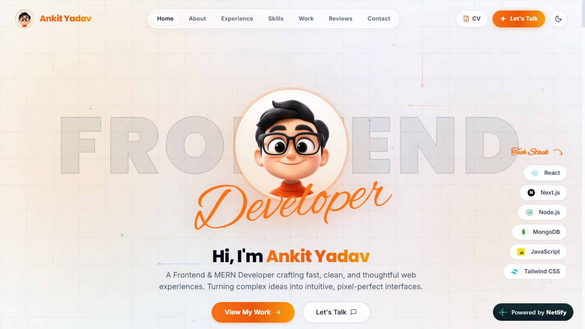
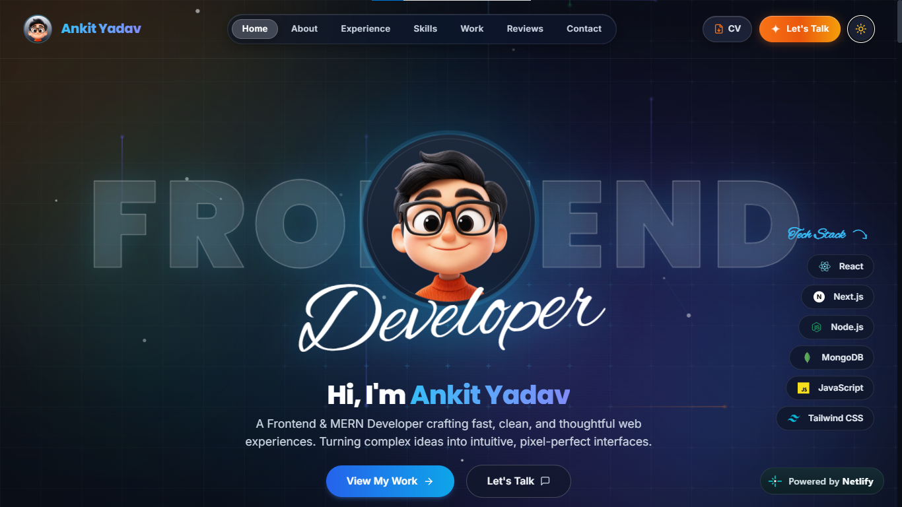

<div align="center">

  # ⚡ Ankit Yadav — Developer Portfolio

  <p align="center">
    <strong>Modern, high-performance developer portfolio built with React 18, Tailwind CSS, GSAP, and Lenis smooth scrolling.</strong>
  </p>

  <p align="center">
    <a href="https://ankityadav456.github.io/My_Portfolio/" target="_blank">
      
    </a>
    
    
    
    
    
  </p>

  <p align="center">
    <a href="#-dark--light-mode-previews">Previews</a> •
    <a href="#-key-features">Features</a> •
    <a href="#-tech-stack">Tech Stack</a> •
    <a href="#-project-structure">Structure</a> •
    <a href="#-getting-started">Getting Started</a> •
    <a href="#-connect--socials">Connect</a>
  </p>

</div>

---

## 🌗 Dark & Light Mode Previews

Experience the cyber-minimalist aesthetic in both dark and light modes, engineered with custom liquid aurora gradients, electric light rays, and interactive blueprint grids.

<table>
  <tr>
    <td width="50%" align="center">
      <h3>🌙 Dark Mode (Cyber Neon)</h3>
      <a href="https://ankityadav456.github.io/My_Portfolio/">
        
      </a>
      <p><em>Electric cyan & amber accents on deep space background</em></p>
    </td>
    <td width="50%" align="center">
      <h3>☀️ Light Mode (Clean Studio)</h3>
      <a href="https://ankityadav456.github.io/My_Portfolio/">
        
      </a>
      <p><em>Crisp typography with frosted glass panels & warm amber tones</em></p>
    </td>
  </tr>
</table>

---

## ✨ Key Features

- **🔥 Unified Animation Architecture**:
  - **Lenis + GSAP**: Single shared GSAP ticker driving Lenis smooth scroll and ScrollTrigger without competing requestAnimationFrame loops.
  - Zero layout jank, buttery 60/120 FPS desktop scroll interpolation with native mobile fallback.

- **🌌 High-Performance Cyber Motion Grid**:
  - CSS-accelerated 56px repeating blueprint grid.
  - Canvas handles moving electric laser beams, luminous glowing tips, and constellation nodes.
  - Automatic frame throttling (~30 FPS) and `IntersectionObserver` pause when scrolled offscreen.
  - Detects touch devices to disable cursor math and halve particle count for mobile CPU efficiency.

- **🎨 Liquid Frosted Glass UI (Apple iOS Aesthetics)**:
  - Multi-layer frosted liquid glass header with dynamic scroll detection (`useLenis`).
  - Active nav indicator with spring-animated layout transition.
  - Responsive mobile drawer menu with smooth backdrop blur.

- **💼 Dynamic Career Timeline**:
  - Interactive work history timeline with scroll-progress tracking.
  - Expandable achievements and tagged production tech stacks.

- **📂 Full-Stack Projects Showcase**:
  - Category filtering tabs (**All**, **MERN Stack**, **React Web Apps**, **Mobile Apps**).
  - Cards featuring key metrics, tech badges, GitHub repository links, and live deployment previews.

- **🌟 Interactive Testimonials Marquee**:
  - Infinite smooth marquee with pause-on-hover capability and GPU hardware compositing.

- **📬 Interactive Contact Section**:
  - Functional contact form integrated with **Getform**.
  - One-click email and phone copy with visual confirmation.
  - Integrated interactive Google Maps modal.

- **♿ Accessibility & Performance**:
  - Full `@media (prefers-reduced-motion: reduce)` support.
  - Optimized asset loading and Vite production tree-shaking.

---

## 🛠️ Tech Stack

### Core Framework & Build
- **[React 18](https://react.dev/)** — Modern component architecture with Hooks & Context API
- **[Vite 6](https://vitejs.dev/)** — Next-generation frontend build tooling & HMR

### Styling & Design System
- **[Tailwind CSS](https://tailwindcss.com/)** — Utility-first CSS framework
- **CSS Backdrop Filter & Keyframes** — Apple iOS frosted glass & ambient floating orbs
- **Google Fonts** — *Inter*, *Poppins*, *JetBrains Mono*, *Alex Brush*

### Motion & Interactions
- **[Lenis](https://lenis.darkroom.engineering/)** (`@studio-freight/lenis` / `lenis/react`) — Smooth inertia scrolling
- **[GSAP 3](https://greensock.com/gsap/)** (`gsap`, `@gsap/react`, `ScrollTrigger`) — Entrance timelines & mouse parallax
- **[Framer Motion](https://www.framer.com/motion/)** — Dynamic scroll progress & layout animations

### Icons & Assets
- **[Lucide React](https://lucide.dev/)** — Modern, lightweight SVG iconography

---

## 📁 Project Structure

```
My_Portfolio/
├── public/                     # Static assets (favicons, resume PDF)
│   ├── favicon.png             # 3D developer avatar favicon
│   └── Ankit_Yadav_ResumeNew.pdf
├── src/
│   ├── assets/
│   │   └── images/             # Project screenshots & tech logos
│   ├── components/
│   │   ├── About.jsx           # Bio, stats counter & highlight cards
│   │   ├── AnimatedBackground.jsx # CSS-driven ambient floating orbs
│   │   ├── Contact.jsx         # Getform contact form & clipboard actions
│   │   ├── Experience.jsx      # Dynamic scroll-filling work timeline
│   │   ├── Footer.jsx          # Site sitemap, socials & back-to-top
│   │   ├── Header.jsx          # Frosted glass header, logo & scrollspy
│   │   ├── Hero.jsx            # Hero banner, GSAP entrance & parallax
│   │   ├── HeroAnimatedBackground.jsx # Cyber grid & electric beam canvas
│   │   ├── MapModal.jsx        # Google Maps embed modal
│   │   ├── ProjectCard.jsx     # Reusable project card with tags & links
│   │   ├── Review.jsx          # Infinite testimonial marquee
│   │   ├── Skill.jsx           # Technical skills filter & grid
│   │   ├── SkillCard.jsx       # Individual skill card
│   │   └── Work.jsx            # Projects gallery with filter tabs
│   ├── context/
│   │   └── ThemeContext.jsx    # Dark/Light mode state & local persistence
│   ├── App.jsx                 # Root wrapper with LenisGSAPBridge
│   ├── index.css               # Design tokens, scrollbar & glass classes
│   └── main.jsx                # Application entry point
├── portfolio1.png              # Dark mode preview screenshot
├── portfolio2.png              # Light mode preview screenshot
├── package.json
└── vite.config.js
```

---

## 🚀 Getting Started

Follow these instructions to get a copy of the project running locally.

### Prerequisites

- **Node.js** (v18.0.0 or higher recommended)
- **npm** or **yarn** / **pnpm**

### Installation

1. **Clone the repository**:
   ```bash
   git clone https://github.com/ankityadav456/My_Portfolio.git
   cd My_Portfolio
   ```

2. **Install dependencies**:
   ```bash
   npm install
   ```

3. **Start the development server**:
   ```bash
   npm run dev
   ```
   Open [http://localhost:5173](http://localhost:5173) in your browser.

4. **Build for production**:
   ```bash
   npm run build
   ```
   The compiled assets will be in the `dist/` directory.

5. **Deploy to GitHub Pages**:
   ```bash
   npm run deploy
   ```

---

## 🌐 Connect & Socials

- **Portfolio**: [ankityadav456.github.io/My_Portfolio](https://ankityadav456.github.io/My_Portfolio/)
- **LinkedIn**: [linkedin.com/in/ankit-yadav](https://www.linkedin.com/in/ankit-yadav)
- **GitHub**: [@ankityadav456](https://github.com/ankityadav456)
- **Email**: [ankit.y.2302@gmail.com](mailto:ankit.y.2302@gmail.com)

---

## 📄 License

This project is licensed under the [MIT License](LICENSE) — feel free to use it as inspiration for your own portfolio!

<div align="center">
  <sub>Designed & Developed with ❤️ by <strong>Ankit Yadav</strong></sub>
</div>
